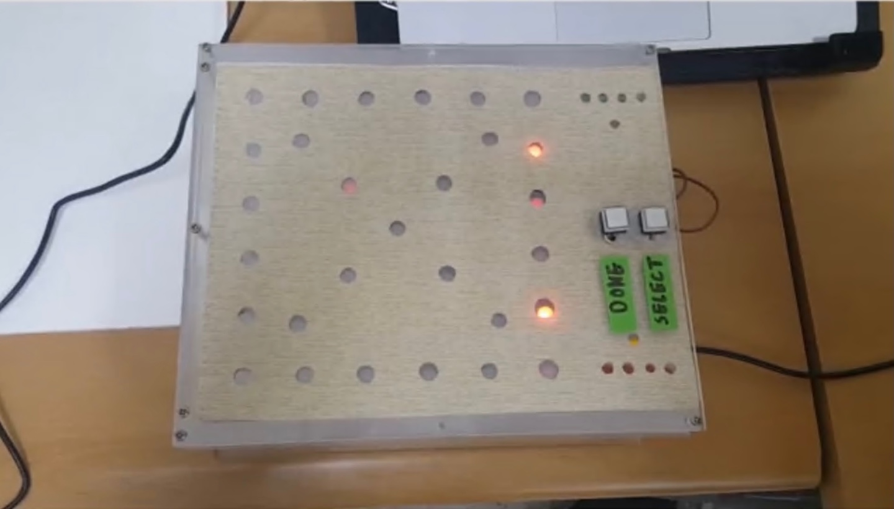
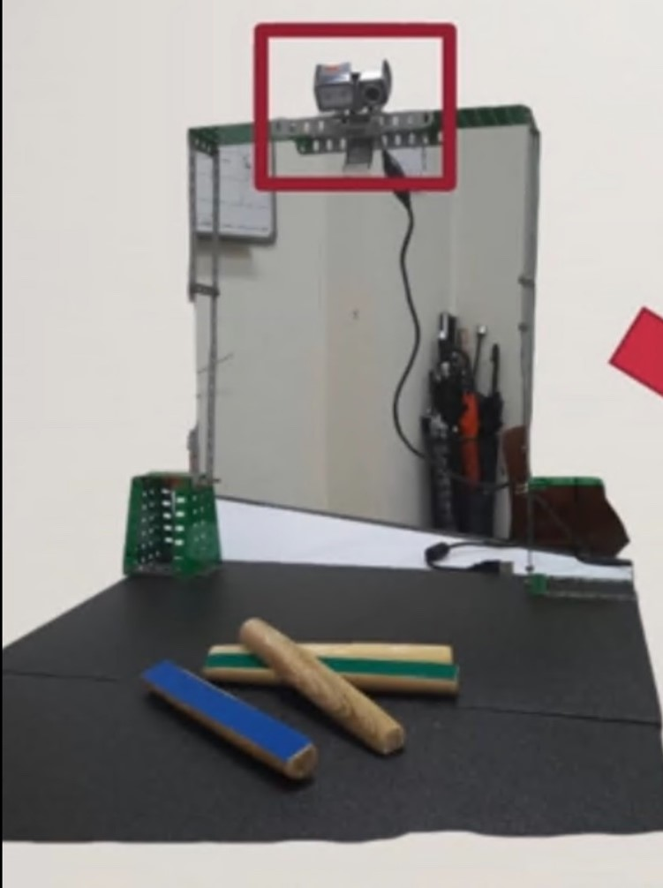
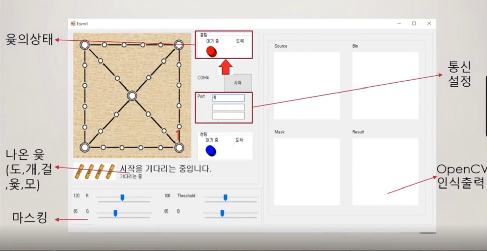
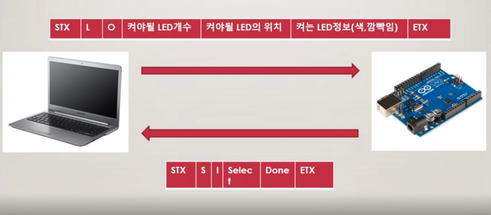
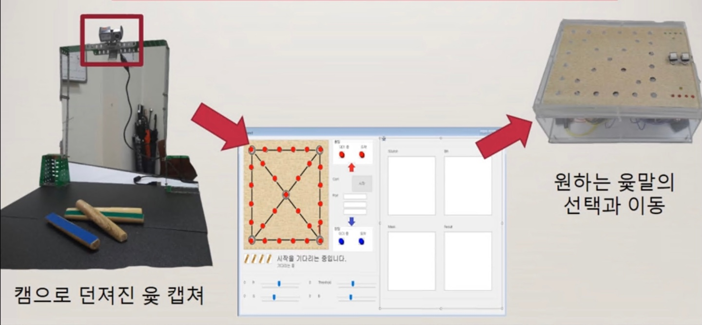
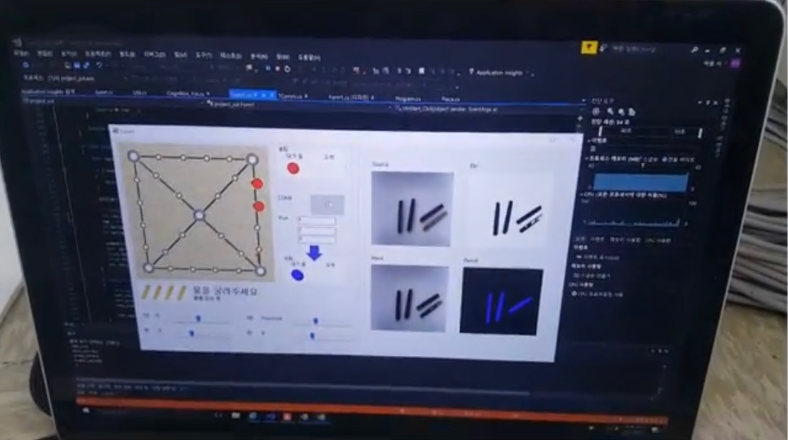

# 3G1S-YutnoriGame
This project was carried out in a Computer Control Programming lecture in the first semester of my third year.  
This lecture gave me first experiance of Computer Vision. And it got me interested.

## 1. Requirments
Code is written in C# requires:
* Library
    * _OpenCvSharp_
* HardWare
    * _Arduino Uno_
    * _WebCam_

----------

## 2. HardWare
**1) Yutnori Board**  
> 
**2) Camera Holder**  
> 

----------

## 3. SoftWare
**1) U.I**  
> 
**2) Communication**  
> 
> 

----------

## 4. Demonstration
**1) Demo Image**  
> 
**2) Demo Video**  
>   
> 

